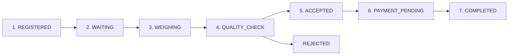

# 🌾 KisanQueue — Intelligent Farmer Procurement Queue & Status Tracking Platform

> **Smart India Hackathon (SIH 2026)** — Problem Statement **SIH26032**: *Farmer Procurement Waiting/Status*

[](https://fastapi.tiangolo.com)
[](https://react.dev)
[](https://scikit-learn.org)
[](https://tailwindcss.com)
[](https://sqlite.org)

---

## 📌 Executive Summary

Agricultural procurement centres (APMC Mandis) across India frequently experience severe physical congestion, unmanaged tractor queues, and days of unnecessary waiting for farmers during peak harvest seasons. **KisanQueue** is an end-to-end intelligent queue management, live status tracking, and AI waiting-time prediction platform built specifically to streamline agricultural procurement.

### Key Capabilities:
1. **Real-time FIFO Queue System**: Dynamic token generation, queue position re-indexing, and live waitlist progression.
2. **7-Stage Procurement Workflow**: `REGISTERED` → `WAITING` → `WEIGHING` → `QUALITY_CHECK` → `ACCEPTED` → `PAYMENT_PENDING` → `COMPLETED` (and `REJECTED`) with immutable timestamped audit history.
3. **AI Waiting-Time Prediction**: Machine learning regression (`RandomForestRegressor`) estimating accurate waiting times with tree-variance confidence intervals and explainable factor attribution.
4. **Mandi Bottleneck Detection**: Real-time stage duration analyzer identifying operational delays (e.g. quality testing backlog vs weighbridge capacity) and providing actionable staff/counter allocation recommendations.
5. **Role-Tailored Portals**:
   - **Farmer Portal**: Ultra-simple, mobile-optimized pass, live stage tracker, and in-app turn alert notifications.
   - **Mandi Officer Terminal**: Live queue management, tare/gross weighing calculation, moisture & dockage grading, acceptance/rejection, and payment triggers.
   - **Mandi Administrator**: BI analytics charts, throughput histograms, crop volume analysis, and bottleneck diagnostics.
6. **1-Click Demo Persona Switcher**: Instant evaluation across Farmer, Officer, and Admin roles with pre-seeded realistic Indian mandi data.

---

## 🏗️ System Architecture

```
                               ┌────────────────────────────────────────────────────────┐
                               │                    React 18 Frontend                   │
                               │        (Vite + Tailwind CSS + Lucide + Recharts)       │
                               └───────────────────────────┬────────────────────────────┘
                                                           │ REST APIs / JWT Auth
                                                           ▼
                               ┌────────────────────────────────────────────────────────┐
                               │                 FastAPI Python Backend                 │
                               │   (Pydantic v2 + SQLAlchemy ORM + Multi-Queue Engine)  │
                               └──────────────┬─────────────────────────┬───────────────┘
                                              │                         │
                                              ▼                         ▼
                        ┌───────────────────────────────┐     ┌────────────────────────┐
                        │     Relational SQLite / DB    │     │   AI Machine Learning  │
                        │ (Procurements, Queue, History)│     │ (RandomForestRegressor)│
                        └───────────────────────────────┘     └────────────────────────┘
```

---

## 🔄 7-Stage Procurement Workflow



1. **`REGISTERED`**: Farmer books a slot online specifying crop type, variety, estimated quintals, and vehicle number. A unique digital token (e.g., `KQ-PB-260902-001`) with QR code is generated.
2. **`WAITING`**: Farmer arrives at Mandi gate and enters the active FIFO queue. Queue position and AI wait time are continuously updated.
3. **`WEIGHING`**: Vehicle called to weighbridge. Officer records Gross Weight and Tare Weight; Net Weight is computed automatically.
4. **`QUALITY_CHECK`**: Grain sample analyzed in quality lab. Moisture percentage, foreign matter percentage, and FAQ grade (Grade A / FAQ / Grade B) are recorded.
5. **`ACCEPTED`**: Consignment approved under FAQ norms. Total MSP amount is automatically calculated based on Government rates.
6. **`PAYMENT_PENDING`**: Payment advice generated for Direct Benefit Transfer (PFMS / DBT).
7. **`COMPLETED`**: DBT transaction confirmed with bank reference number; payout credited directly to farmer's bank account.
8. **`REJECTED`**: If moisture or purity violates permissible limits, rejection reason is recorded, and advisory is sent to the farmer.

---

## 🤖 Machine Learning Waiting-Time Engine

- **Model**: `RandomForestRegressor` ensemble (120 estimators, depth 14).
- **Training Dataset**: Synthetic Indian Mandi procurement dataset (~4,000 records) modeling harvest seasonality, queue congestion, counter throughput, and crop inspection complexities.
- **Evaluation Metrics**:
  - **RMSE**: ~3.4 minutes
  - **MAE**: ~2.5 minutes
  - **$R^2$ Score**: > 0.94
- **Input Features**:
  1. `farmers_ahead`: Number of vehicles waiting ahead in queue.
  2. `crop_type`: Paddy, Wheat, Mustard, Cotton, Maize, Soybean, Gram (categorical).
  3. `quantity_quintals`: Consignment load weight.
  4. `active_weighing_counters`: Number of operational weighbridges.
  5. `active_quality_counters`: Number of operational inspection labs.
  6. `active_staff_count`: Total on-duty mandi staff.
  7. `avg_recent_stage_duration`: Rolling average stage time per farmer.
  8. `hour_of_day`: Mandi arrival hour (modeling lunch/rush traffic).
  9. `is_peak_season`: Kharif / Rabi peak harvest factor.
- **Explainable AI (XAI)**: Breaks down the prediction into human-readable influencing factors (e.g., `+18 mins due to 5 farmers ahead`, `-12 mins due to 3 active weighbridges`).

---

## 🗄️ Relational Database Schema

| Table | Purpose | Key Fields |
|---|---|---|
| `users` | User credentials & roles | `id`, `email`, `password_hash`, `full_name`, `phone`, `role` |
| `farmers` | Farmer KYC & bank data | `user_id`, `farmer_id_card`, `aadhaar_last4`, `state`, `district`, `bank_account_no`, `ifsc_code` |
| `procurement_centres` | APMC Mandi details & counters | `code`, `name`, `state`, `active_weighing_counters`, `active_quality_counters`, `active_staff_count` |
| `officers` | Mandi officer profile | `user_id`, `centre_id`, `badge_number`, `designation`, `assigned_counter` |
| `procurements` | Crop procurement records | `token_number`, `farmer_id`, `crop_type`, `actual_quantity`, `status`, `grade`, `moisture_percentage`, `total_amount` |
| `queue_entries` | Live FIFO queue indexes | `procurement_id`, `centre_id`, `queue_number`, `status`, `assigned_counter`, `called_at` |
| `status_history` | Immutable audit trail | `procurement_id`, `from_status`, `to_status`, `remarks`, `counter_number`, `stage_duration_seconds` |
| `payments` | DBT & PFMS payout records | `procurement_id`, `farmer_id`, `amount`, `msp_rate`, `status`, `transaction_ref`, `credited_at` |
| `notifications` | In-app turn & stage alerts | `user_id`, `procurement_id`, `title`, `message`, `type`, `is_read` |
| `prediction_logs` | ML inference logs & telemetry | `procurement_id`, `farmers_ahead`, `predicted_minutes`, `confidence_score` |

---

## ⚡ Quick Start & Local Setup Instructions

### Prerequisites
- **Python 3.10+** (Tested on Python 3.10 - 3.14)
- **Node.js 18+** & **npm**

### Step 1: Clone or Navigate to Directory
```bash
cd AgriNexus
```

### Step 2: Install Backend Dependencies & Train ML Model
```bash
python -m pip install -r backend/requirements.txt
python ml/train.py
```

### Step 3: Install Frontend Dependencies
```bash
cd frontend
npm install
cd ..
```

### Step 4: Run Application (Single Command)
```bash
python run_app.py
```

*Alternatively, run backend and frontend in separate terminals:*
```bash
# Terminal 1: Backend
cd backend
python -m uvicorn app.main:app --reload --port 8000

# Terminal 2: Frontend
cd frontend
npm run dev
```

---

## 🌐 Access URLs & Demo Accounts

- **Web Application**: [http://localhost:5173](http://localhost:5173)
- **Interactive Swagger API Docs**: [http://localhost:8000/docs](http://localhost:8000/docs)
- **ReDoc Documentation**: [http://localhost:8000/redoc](http://localhost:8000/redoc)

### Pre-Seeded Demo Accounts (1-Click Switcher available in UI):

| Role | Name | Email | Password | Pre-seeded Context |
|---|---|---|---|---|
| **🌾 Farmer** | Ramesh Kumar | `ramesh.kumar@kisannexus.gov.in` | `farmer123` | Active Paddy token in Queue #1 at Samrala Mandi |
| **🌾 Farmer** | Sardar Gurpreet Singh | `gurpreet.singh@kisannexus.gov.in` | `farmer123` | In Weighing stage at Weighbridge 1 |
| **🌾 Farmer** | Harpreet Kaur | `harpreet.kaur@kisannexus.gov.in` | `farmer123` | In Quality Testing Lab 1 |
| **📋 Officer** | Priya Sharma | `officer.priya@kisannexus.gov.in` | `officer123` | Chief Weighbridge & Inspector terminal |
| **📊 Admin** | Rajesh Verma | `admin@kisannexus.gov.in` | `admin123` | Mandi analytics & bottleneck diagnostics |

---

## 🚀 Key API Endpoints

- `POST /api/v1/auth/login` — Authenticate user and receive JWT access token.
- `POST /api/v1/auth/register` — Register a new farmer with PM-KISAN KYC & DBT details.
- `GET /api/v1/farmers/me/active-token` — Retrieve farmer's live procurement token with queue position and ML wait estimate.
- `POST /api/v1/procurements` — Book a procurement slot and enter the live mandi queue.
- `PATCH /api/v1/procurements/{id}/stage` — Advance procurement through the 7 stages (Weighing, Quality Check, Acceptance, Payment, Completion).
- `GET /api/v1/queue/centre/{centre_id}` — Fetch active FIFO queue for a specific Mandi centre.
- `POST /api/v1/prediction/waiting-time` — Inference endpoint for the Random Forest waiting-time regressor.
- `GET /api/v1/analytics/dashboard` — Mandi throughput analytics, crop distribution, and automated bottleneck detection.
- `GET /api/v1/notifications` — Retrieve in-app alerts and turn notifications.

---

## 🏆 SIH 2026 Innovation Highlights

1. **Zero-Wait Mandi Entry**: Farmers only leave their fields when their estimated turn is within 30 minutes, cutting physical mandi congestion by up to 60%.
2. **Transparent MSP & Weighing**: Both gross and tare weights are published instantly to the farmer's portal, preventing malpractices.
3. **Automated Bottleneck Remediation**: The platform proactively informs mandi directors when quality labs or weighbridges exceed target cycle times.
4. **Offline-Ready Printable Passes & QR Scanning**: Compatible with rural internet constraints via QR token passes and SMS alerts.
